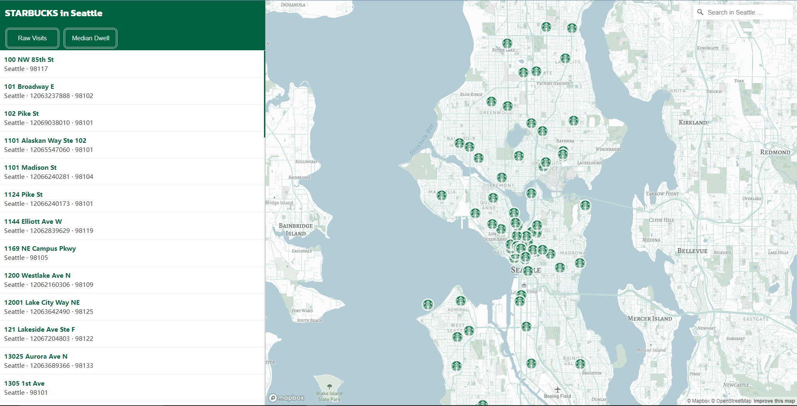
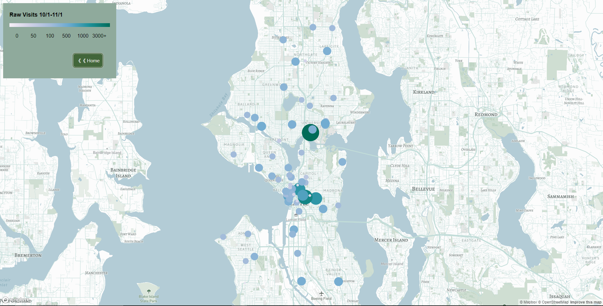
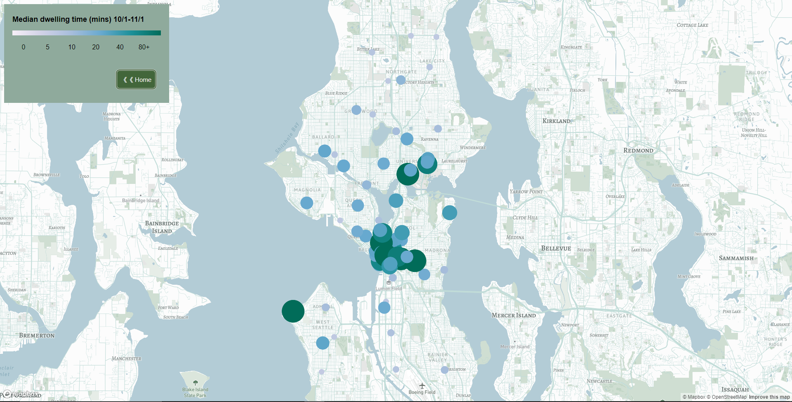
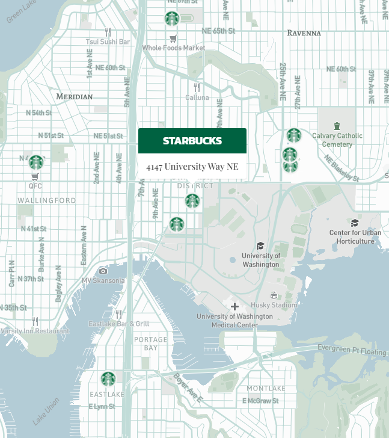
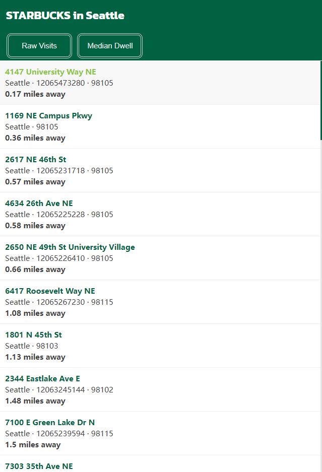

# GEOG 495 Final Project
## Title: **Nearest Starbucks and consideration on passenger flow**

#### Application URL:

stephenwzy.github.io/final_project/index.html

#### Project Description:

The final project is designed as an interactive map application that contains one main page and two sub pages. The application shows the distribution of Starbucks coffee shops in Seattle City. By using turf.js advanced geospatial distance analysis, The application will sort out the nearest Starbucks based on the geographic locations (nominal locations) provided by users in the search bar. The app offers two buttons on the index page (home page). The first one directs to the visualization of raw visits, which displays the pattern of the sum of raw visits in each Starbucks from 2021/10/1 - 2021/11/1 based on POI data. The second one directs to the visualization of dwelling time, which displays the pattern of visitors' median dwelling time in each Starbucks based on POI data.

#### Data Source and Data Operation:

The data used in this application is downloaded from [SafeGraph]('www.safegraph.com') which is a company offering data of points of interest (POI). Points of interest are always some landmarks and viewpoints that are used to mark some commercial organizations, goverment departments, etc. The POI information is complex and rich, because the data is directly cpatured from mobile phone users. To a large extent, this feature can enhance the abilibry to describe and query the location of things or events, and improve the accuracy and speed of geocoding. SafeGraph obtains GPS data by regularly pinging 18 million smartphones with certain apps each day. In this way, we are able to use passengers' mobile phone as a medium to monitor the specific POI data of Starbucks.

SafeGraph provides multiple types of datasets. In this application, I downloaded "Core Places" .csv file, which contains basic information of each Starbucks, including the geographic coordinates. I also downloaded "Patterns" .csv file, which contians various types of POI data. I used Rstudio to merge two .csv by the column "street_address" and get a dataset containing both patterns and geographic coordinates. Then I used QGIS to convert the .csv file to a .geojson file that I can load in javascript.

#### Main Functions:
This is a relatively daily map application. The application basically provides two functions: 
1. <u>**Location sorting based on distance:**</u> On the index page, users will see 1/3 of this page is occupied by a list that can be scrolled, listing Starbucks items with the street addresses, city, phone numbers, and zip codes. 2/3 of this page is occupied by an interactive map. The base map is in a light-colored style and highlights the traffic system to make a clear contrast to the marker and help users have a better sense of locations. By introducing turf.js and geocoder libraries, the application can realize distance sorting whenever users search one specific place in Seattle City (the bounding box is constrained in Seattle City). The list will make an ascending sorting from the nearest Starbucks to the farthest. The distance between Starbucks and the search address will show up in the list.

2. <u>**Passenger flow information visualization:**</u> This part of the function will be separated into two different pages. Users can click two buttons in the heading part on the index page. The first one, "Raw Visits," directs to a page that helps users visualize the pattern of the sum of raw visits of each Starbucks from 2021/10/1-2021/11/1. Both the radius and color gradient allows users to understand the difference in the number of people in each Starbucks. The second button, "Median dwell," directs to a page that helps users visualize the pattern of the median dwelling time of visits of each Starbucks from 2021/10/1-2021/11/1. The Larger radius and the darker color mean a longer median dwelling time.

#### Project Goal:

It is trying to allow users to make a comprehensive consideration of geographic distance, passenger flow, and passenger dwelling time. Especially in the context of a pandemic, such consideration became more important. When users use this application, they can decide which Starbucks to go to based on this information. Not only considering how far one site from the user, but the users should consider about how crowd it is and assess whether there is a risk of being infected or contacting virus carriers if they work or study in the coffee shop for a relatively long time. Even though it is impossible to capture the real-time passenger flow data, based on the POI data in the previous month, a pattern of passenger flow information can be roughly inferred.

#### Screenshots
Sum of raw visits from 2021/10/1 to 2021/11/1: 

Median of dwelling time of all visits from 2021/10/1 to 2021/11/1:

Pop-up box:

Sorting list:

#### Applied Libraries and Web Services
1. Mapbox GL js - 
2. Turf
3. Github
4. Google fonts
5. Mapbox Studio (basemap design)

#### Acknowledgement
I would acknowledge that this project is based on the 

